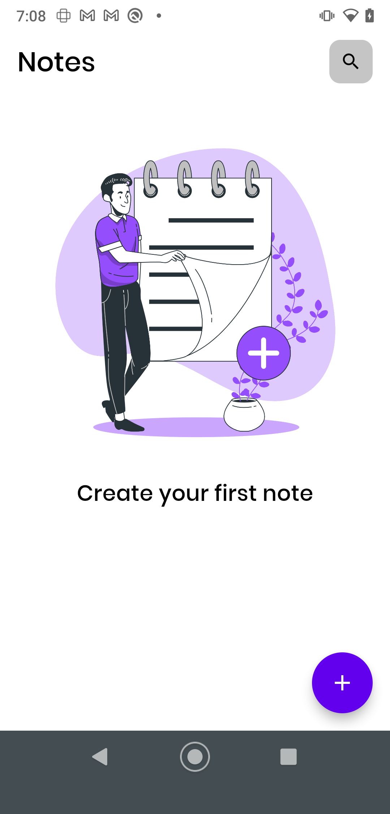
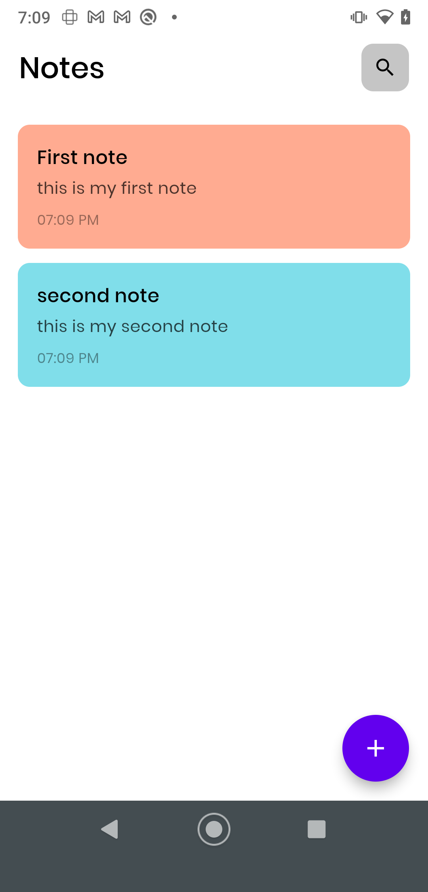
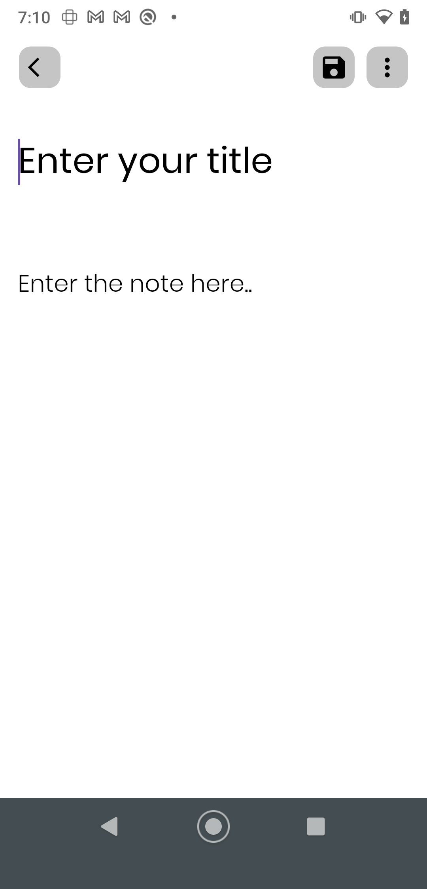
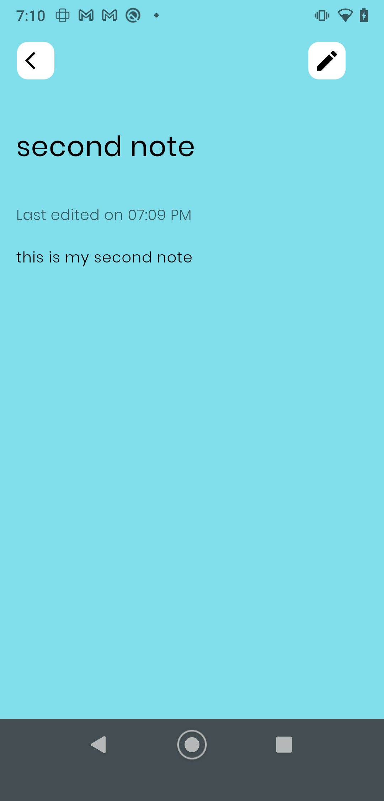
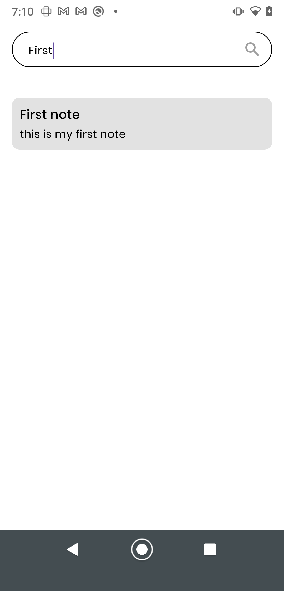
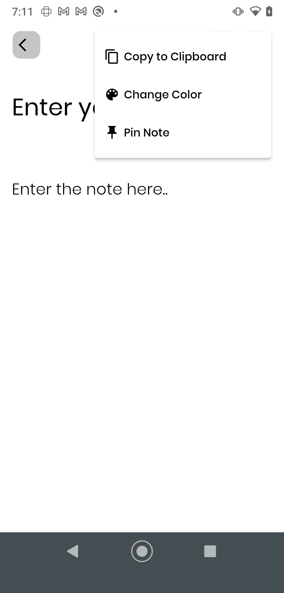

# 📝 Notes App

Welcome to Notes App! Your go-to tool for keeping your thoughts, ideas, and tasks organized. Built with Flutter, this app combines simplicity with power to help you manage your notes effortlessly.

## ✨ Features

Organize Notes: Create, edit, and delete notes with ease.
Categorize & Tag: Organize notes into categories and add tags for quick retrieval.
Search Functionality: Find your notes in seconds with our robust search feature.
Dark Mode: Switch to dark mode for a comfortable viewing experience at night.

## 🚀 Getting Started

To get started with **Notes App**, follow these steps:

1. **Clone the Repository**

   ```
   git clone https://github.com/shiburajrs/flutter-note-app.git
   cd notes_app
   ```


2. **install Dependencies**

   ```bash
   flutter pub get
   ```

3. **Run the App**

```bash
flutter run
```


## 📸 Screenshots

Here are some screenshots of the **Notes App** in action:

### Home Screen



### Add Note Screen



### Edit Note Screen



### Note Detail Page



### Search Page



### More Options



## 🤝 Contributing

We'd love your contributions! If you have ideas or improvements, please fork the repository and submit a pull request. Open an issue for major changes so we can discuss them first.

Happy note-taking! 🎉

